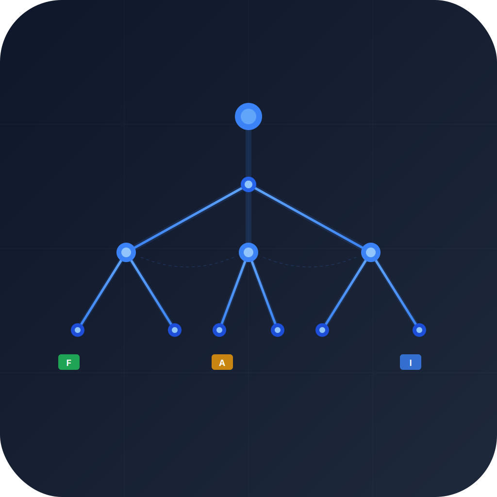
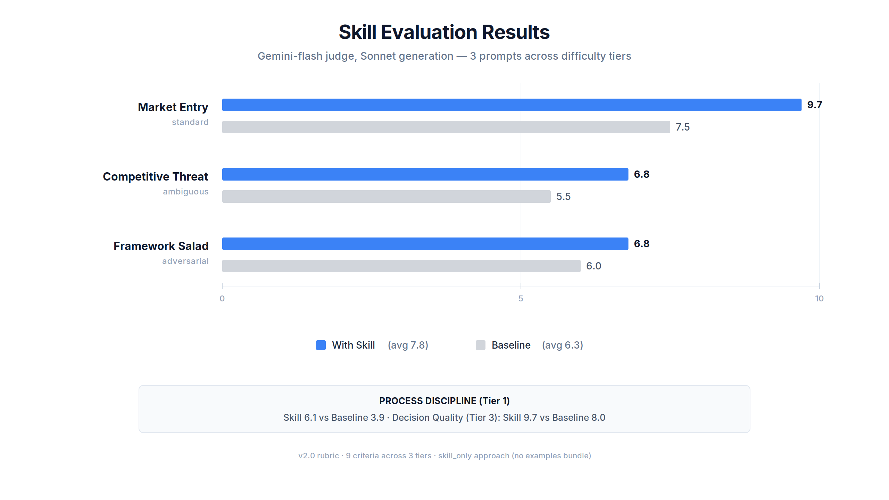

<p align="center">
  
</p>

# management-consulting — Strategy Skill for AI Coding Agents

Turn your AI agent into a structured thinking partner for strategy, decisions, and analysis. 42 frameworks with practitioner-grade depth — not textbook theory, but step-by-step workflows, real examples, common mistakes, and when each framework breaks down.

Built for Claude Code. Compatible with Codex, Gemini CLI, Cursor, and any agent that reads SKILL.md files.

## Why this exists

Asking an LLM to "act like a consultant" produces generic framework-salad. This skill fixes that by providing:

- **Process discipline** — clarify the decision before analyzing. Structure before hypothesizing. Evidence-label every claim.
- **Framework depth** — 4,100+ lines of practitioner workflows across 42 frameworks. Each has step-by-step application, good/bad output examples, common mistakes, and failure conditions.
- **Three modes** — Quick Structure (exploratory), Full Case (analytical), Client Deliverable (polished). Matches response depth to your actual need.
- **Quality gates** — output contract, devil's advocate step, 9-point checklist. Prevents shallow answers.
- **Anti-selection rules** — tells the agent when NOT to use a framework. Stops Five Forces on every strategy question.

## Install

```bash
# Claude Code
cp -r management-consulting/ ~/.claude/skills/management-consulting/

# Or use npx
npx skills add gcamilo/management-consulting
```

## Usage

Just ask naturally. The skill activates on strategy questions, decisions, market analysis, due diligence, or structured recommendations.

**Quick Structure** — thinking out loud, exploratory
> "Help me think through build vs buy for our data pipeline"

**Full Case** — specific decision with real stakes
> "Should we expand into the mid-market segment?"

**Client Deliverable** — deck-ready, stakeholder-facing
> "Draft a strategy memo for the board on our market entry options"

## What's inside

```
management-consulting/
├── SKILL.md (258 lines)                    # Core: modes, workflow, output contract
├── references/
│   ├── frameworks-strategy.md (798 lines)  # Five Forces, Value Chain, 7S, VRIO, Blue Ocean...
│   ├── frameworks-financial.md (781 lines) # Profit Tree, Revenue Tree, TAM/SAM/SOM, Unit Econ
│   ├── frameworks-decision.md (708 lines)  # RAPID, Decision Matrix, Pre-Mortem, Inversion
│   ├── frameworks-pricing.md (688 lines)   # Value-Based, Cost-Plus, Competitive, Dynamic, Freemium
│   ├── frameworks-problem-solving.md (511) # MECE, Issue Tree, Hypothesis Tree, Pyramid
│   ├── frameworks-operations.md (484)      # ADKAR, Kotter, Lewin, Customer Journey, NPS
│   ├── frameworks-innovation.md (390)      # JTBD, Business Model Canvas, Advantage Matrix
│   ├── diagram-templates.md (231 lines)    # 12 diagram types (SVG templates)
│   ├── tooling-appendix.md (69 lines)      # Optional: rendering pipeline, themes
│   ├── frameworks-index.md (59 lines)      # Quick-reference: all 42 frameworks, one-line each
│   └── evidence-standards.md (24 lines)    # Claim labeling: Fact / Inference / Assumption / Estimate
├── examples/
│   ├── end-to-end-full-case.md (117)       # SaaS mid-market expansion (complete walkthrough)
│   ├── issue-tree-good-vs-bad.md (78)      # Before/after comparison
│   ├── recommendation-good-vs-bad.md (45)  # Before/after comparison
│   └── end-to-end-quick-structure.md (36)  # Build vs Buy (light mode)
└── variants/
    ├── strategy-memo.md (102)              # Pyramid Principle + SCQA + deck outline
    ├── due-diligence.md (81)               # Commercial DD + red flags
    ├── market-entry.md (80)                # Five Forces + TAM + positioning
    └── org-effectiveness.md (62)           # 7S + ADKAR + stakeholder mapping
```

**22 files. ~5,700 lines. ~333K chars.**

## Framework depth

Every framework reference file includes (per framework):

| Section | What it provides |
|---|---|
| **When to use** | The specific problem type this framework solves |
| **Step-by-step workflow** | Numbered practitioner steps — not theory, the actual work |
| **Good vs bad output** | Concrete examples with real numbers showing shallow vs actionable |
| **Common mistakes** | 3-5 things practitioners get wrong, with root cause |
| **When it breaks down** | Failure conditions — when the framework misleads |
| **Best combinations** | Which frameworks pair well, in what sequence |

### 42 frameworks across 7 categories

> **[Visual Reference Guide](https://gcamilo.github.io/management-consulting/)** — interactive cards with diagrams, examples, step-by-step mechanics, and key questions for each framework.

**[Strategy (11)](https://gcamilo.github.io/management-consulting/#strategy):** Five Forces, Value Chain, 7S, VRIO, 3 Horizons, Ansoff, Growth-Share Matrix, Nine-Box, Blue Ocean, Wardley Mapping, Scenario Planning

**[Problem Solving (6)](https://gcamilo.github.io/management-consulting/#problem-solving):** MECE, Issue Trees, Hypothesis Trees, 7-Step Problem Solving, Pyramid Principle, SCQA

**[Decision Making (5)](https://gcamilo.github.io/management-consulting/#decision-making):** RAPID, Decision Matrix, Pre-Mortem, Second-Order Thinking, Inversion

**[Financial (5)](https://gcamilo.github.io/management-consulting/#financial):** Profit Tree, Revenue Tree, TAM/SAM/SOM, Unit Economics, Waterfall/Bridge

**[Operations (6)](https://gcamilo.github.io/management-consulting/#operations):** ADKAR, Kotter's 8-Step, Lewin's Change Model, Influence Model, Customer Journey, NPS

**[Innovation (4)](https://gcamilo.github.io/management-consulting/#innovation):** Jobs to Be Done, Business Model Canvas, Value Proposition Canvas, Advantage Matrix

**[Pricing (5)](https://gcamilo.github.io/management-consulting/#pricing):** Value-Based, Cost-Plus, Competitive, Dynamic, Freemium

## How it was built

1. **3-way AI research** — Gemini, Codex, and Claude independently researched all 42 frameworks in parallel (21 research tasks, 497K chars of raw material)
2. **Synthesis** — 4 agents merged the best from each AI per category. Took the sharpest examples, cut textbook filler, resolved disagreements.
3. **3 rounds of adversarial review** — Codex (scored 7/10), Gemini (scored 9.4/10), and self-review identified gaps in portability, completeness, and actionability. All addressed.
4. **A/B eval** — 7-way comparison of different reference configurations to find the highest-impact bundle.
5. **v2 eval redesign** — 9-criteria rubric with programmatic checkers, pairwise comparison with position swap, and Gemini+Codex adversarial review of the eval plan itself. Key finding: baseline beating the skill on some prompts revealed a skill bug (hard gate too aggressive — the skill stopped at clarifying questions on vague prompts instead of stating assumptions and proceeding), not a measurement problem. But the rubric redesign was needed to properly measure process discipline, which the v1 absolute scoring missed.

## Eval results

### Primary: Anthropic skill-creator eval (`/skill-creator`)

Blind A/B comparator built into Claude Code. An Opus judge scored outputs without knowing which used the skill.

**Skill wins 3/3 test cases:**

| Prompt type | Skill | Baseline |
|---|---|---|
| Market entry | 9.5 | 7.0 |
| Competitive threat | 9.0 | 5.5 |
| Framework salad | 9.0 | 7.0 |
| **Average** | **9.2** | **6.5** |

The judge identified **process discipline** as the key differentiator — the skill enforces structured framing and evidence labeling that the baseline skips.



### Supplementary: Custom dual-judge eval ([gcamilo/skill-eval](https://github.com/gcamilo/skill-eval))

9-criteria rubric across 3 tiers, scored by Gemini 3.1 Pro + Claude Sonnet independently.

| Tier | What it measures | Skill delta |
|------|-----------------|-------------|
| T1 — Process Discipline | Structure, framing, evidence | **+1.6** |
| T2 — Output Quality | Specificity, insights, formatting | **+0.6** |
| T3 — Decision Quality | Options, falsifiability, assumptions | **+0.4** |

Notable findings:
- **Easy prompts show the largest T1 gap** (+4.8) — the skill enforces structure that the model naturally skips on simple questions
- **Evidence labeling is the sharpest signal** — 48–99 labeled claims per response vs 0 baseline; no overlap between distributions

## Customization

- **Add variants** — `variants/your-scenario.md` with upfront questions, required frameworks, deliverables
- **Add examples** — `examples/your-example.md` showing input → mode → output
- **Adjust strictness** — edit hard gate, output contract, or quality checklist in SKILL.md
- **Add frameworks** — create or extend `references/frameworks-{category}.md`

## License

MIT
